# Taller de NLP con Watson

## Material
El material del curso se encuentra en [enlace](https://ibm.ent.box.com/s/2qw5uodjhoqltv7m4nle9b2dzzoco8og).

## Introducción

Primero hemos de crearnos una cuenta en Bluemix y acceder al espacio de trabajo de Bluemix.
Cada proyecto tiene asociado un repositorio de código, una interfaz de desarrollo, una interfaz para desplegar la aplicación
así como herramientas de diseño. Bluemix se encarga directamente de ofrecerte un entorno integrado donde comenzamos a
trabajar directamente. Y el despliegue es automático.

Aunque también se puede utilizar tu propio entorno de desarrollo y conectarse para realizar la publicación.

## Laboratorios

### Laboratorio 1: desplegar la primera aplicación via Web

La idea en este laboratorio es crear una primera aplicación en Bluemix. Una vez dentro de Bluemix, vamos a *catalog* y buscamos una aplicación *Node.js Cloudant DB Web Starter*.
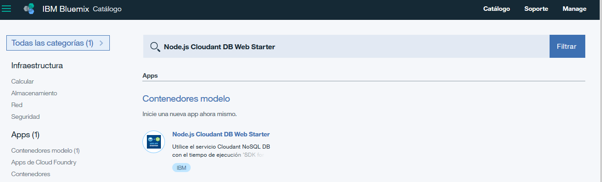

Debemos hacer doble click en el icono para crear la aplicación. Rellenaríamos el formulario y haríamos click en el botón de *Crear*.

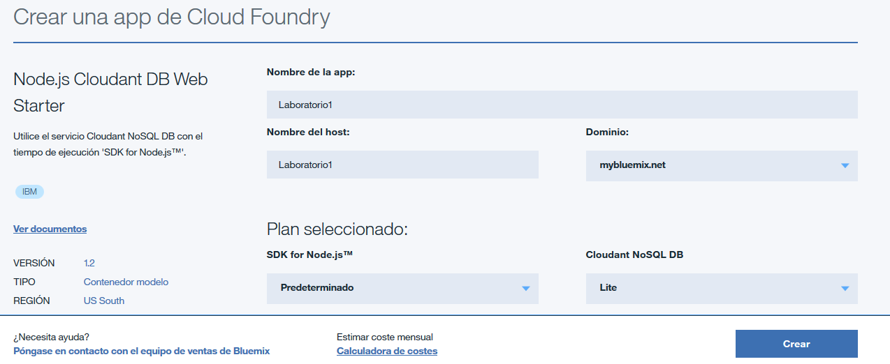

Por último, cuando tenemos listo el proyecto ya podemos verlo funcionando. Desde el botón *Rutas* podemos comprobar como funciona.

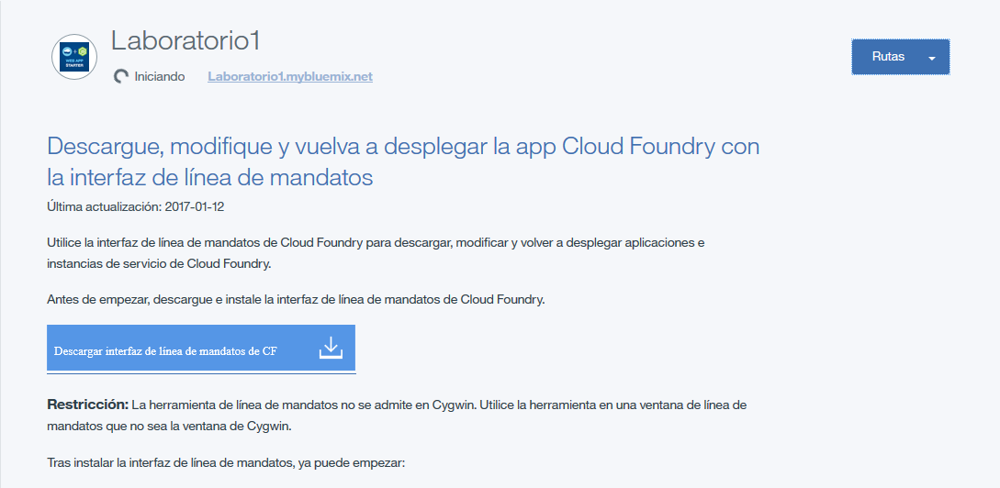

Podemos comprobar que funciona mediante el enlace de la aplicación cuyo aspecto es el siguiente:

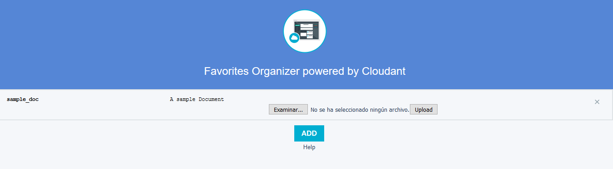

Una vez terminado podemos paramos la aplicación de prueba.

### Laboratorio de NLP: Sombrero

Este ejercicio pretende usar un clasificador natural de lenguaje mediante Watson y utilizarlo dentro de una aplicación
sencilla. 

La descripción del ejercicio es: *Este ejercicio está basado en una idea de Ryan Anderson y consiste en crear un clasificador que simule el sombrero seleccionador que vimos en las películas y libros de Harry Potter.*

Empezamos por buscar en el catalogo dentro de *Servicios* la opción *Watson*. De todas las opciones seleccionamos *Natural Language Classifier*.
 
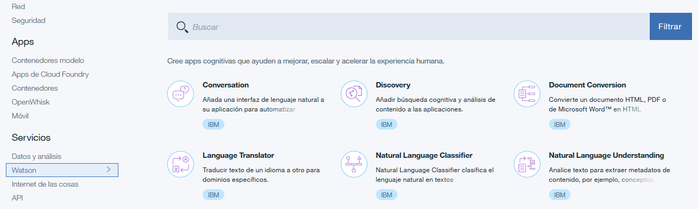

Una vez abierto, tendremos que rellenar el formulario con la información del clasificador y hacemos clic en el botón de *Crear*:

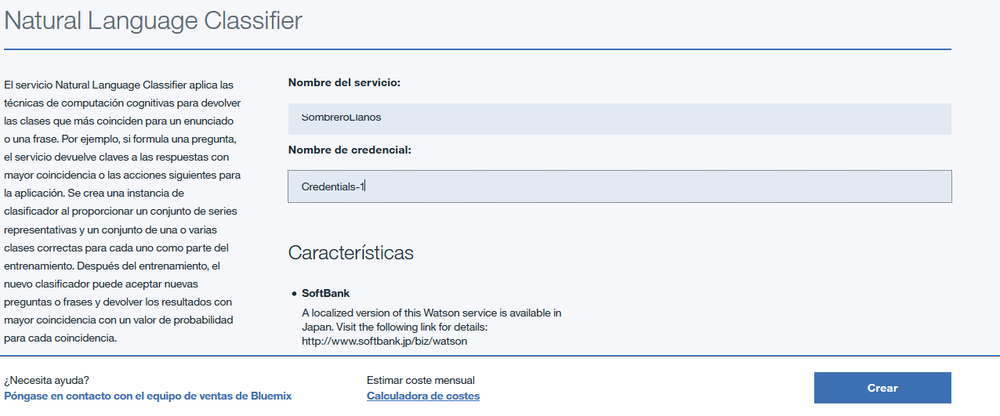

Cuando se ha creado nos aparece una ventana para entrar al servicio que hemos creado. Para acceder podemos entrar en *Access to beta toolkit*.
Se nos abre una nueva ventana donde debemos logearnos de nuevo para acceder. Y además debemos confirmar que permitimos el acceso a Watson.

Una vez dentro, ya podemos añadir los datos de entrenamiento en el cuadrado que se nos ofrece. Para ello debemos hacer clic en *Add Training Data*.

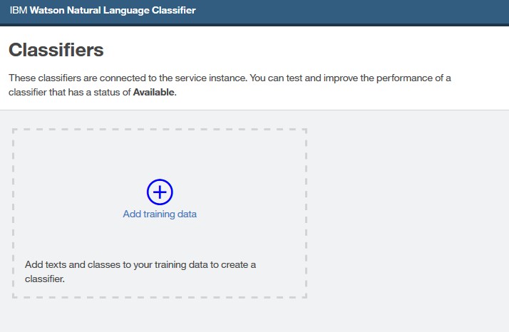

Dentro ponemos el CSV que clasifica según propiedades las casas de Howgards.

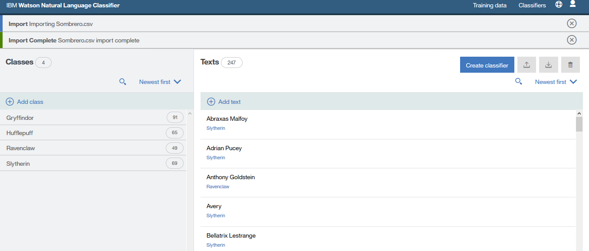

Y ahora hacemos clic en *Create classifier* en la parte superior derecha de la ventana. Rellenamos el formulario
siguiente:

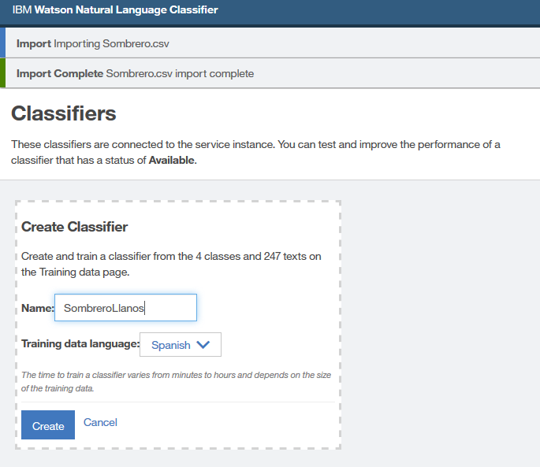

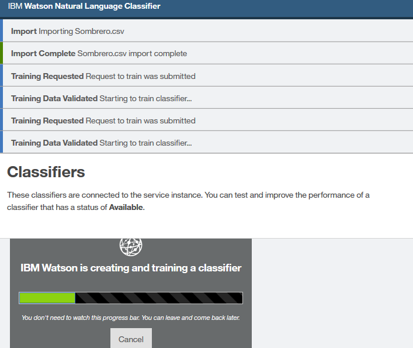

Una vez listo ya tenemos un identificador para poder usarlo en la aplicación. Volvemos a la pestaña del navegador en el que tenemos la consola de administración de Bluemix. Pulsamos en *Service Credentials*.
Y vemos las credenciales del servicio.

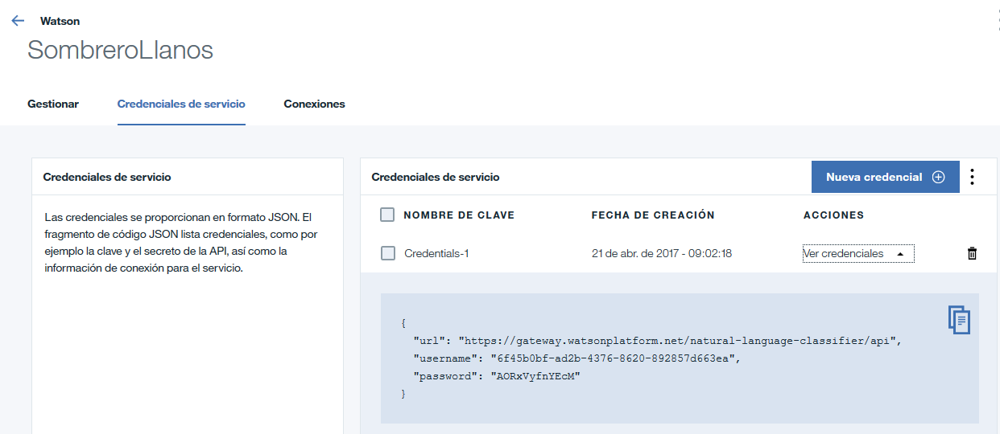

Ahora vamos a crear un cliente. Volvemos al catalogo y buscamos una aplicación *Node-Red starter*:

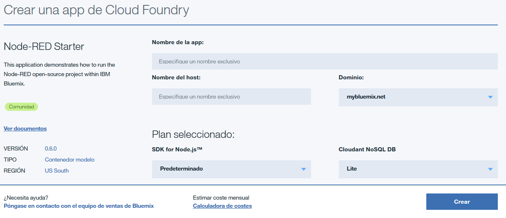

Esperamos que se inicie la aplicación. Hacemos clic en el enlace que aparece el enlace de la ruta. Se abre un editor
para poder configurar. En el primer paso nos indica si queremos crear un usuario y una contraseña para proteger el editor.
En el siguiente paso podemos elegir los bloques adicionales, en este ejemplo no vamos a usar ninguno así vamos directamente a 
*Next*. Y llegamos al final de la aplicación. Tras este asistente podemos ir ya al editor de flujo de Node-red.

 Añadimos los nodos a nuestra zona de trabajo. Los nodos se añaden seleccionándolos y arrastrándolos. Son tres nodos: Inject, Watson Natural Language Classifier y Debug.
 Y los conectamos.

Modificamos el primero nodo, cambiando el payload a string para añadir el texto. 

De forma similar, conectamos el servicio NLP con el bloque de clasificador utilizando los datos del servicio.
Cuando estemos listos hacemos clic en el botón *Deploy*.
Para ejecutarlo hay que hacer clic en el primer bloque en el cuadradito azul. Y vemos los resultados en la pestaña de *Debug*.

